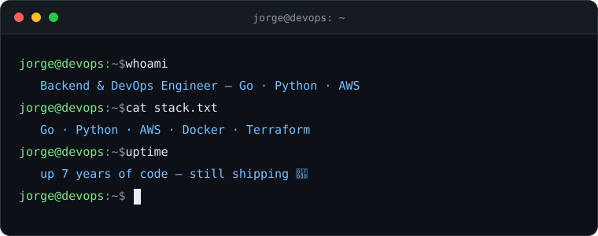

  

---

### 📟 `$ ls ~/projects`

#### 🐹 [`csizer`](https://github.com/JJunior19/csizer)
> Go CLI that watches your Docker containers' real usage and recommends right-sized CPU/memory limits — **local-first**, no cloud telemetry, no agents.

---

### 🧰 `$ cat stack.config`

---

### 📊 `$ ./stats.sh --user JJunior19`

  
  

---

### 🐍 `$ systemctl status snake`

  <picture>
    <source media="(prefers-color-scheme: dark)" srcset="https://raw.githubusercontent.com/JJunior19/JJunior19/output/github-contribution-grid-snake-dark.svg" />
    <source media="(prefers-color-scheme: light)" srcset="https://raw.githubusercontent.com/JJunior19/JJunior19/output/github-contribution-grid-snake.svg" />
    
  </picture>

---

  

  <i>⌨️ perfil estilo terminal — porque los pipelines no se arreglan solos</i>

